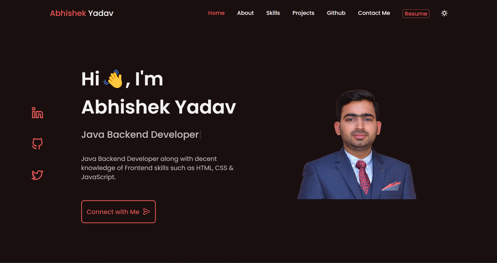
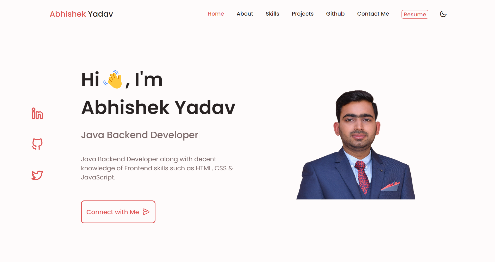

# Responsive Portfolio Website

This project is a personal portfolio website built using HTML, CSS, and JavaScript. It is designed to showcase my skills, projects, and experience in a clean and user-friendly manner. The website features smooth scrolling, light and dark modes, and is optimized for both mobile and desktop devices.

## Features
#### Responsive Design: 
Developed using the Mobile First methodology, ensuring compatibility with all mobile devices.
#### Smooth Scrolling: 
Enhances user experience by providing seamless navigation between sections.
#### Light and Dark Modes: 
Allows users to choose their preferred viewing mode for comfortable browsing.
#### User-Friendly Interface: 
The website offers an intuitive and visually appealing interface for a pleasant experience.

## Getting Started
Clone the repository:

* bash
* Copy code
* git clone https://github.com/abhishekyadav0888/abhishekyadav0888.github.io 
* Open the index.html file in your preferred web browser.

## Usage
Replace the content in the HTML files with your own information, including projects, skills, and experience.
Customize the styles in the CSS files to match your personal branding.

## Contributing
If you'd like to contribute to this project, please follow these steps:

* Fork the repository
* Create a new branch (git checkout -b feature/new-feature)
* Make your changes and commit them (git commit -m 'Add new feature')
* Push to the branch (git push origin feature/new-feature)
* Open a pull request

## Acknowledgments
* Normalize.css
* Font Awesome

## Contact
For any inquiries or feedback, please contact me at abhishekyadav0888@gmail.com
